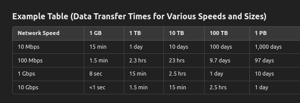

# last moments tips

## GCS

* file transfer speeds as below
 

## Custom ML

* custom training allows for tuning hyperparameters
* AutoML training tunes hyperparameters for you (on its own)

## Data Studio

* Extracted data sources are snapshots and can provide better performance than live data
* There is no imported data source

## Pub SUb

## DataProc

* primary workers are non-preemptible, secondary can be preemptible (but only SPOT is not possible)

    ```shell
    gcloud dataproc clusters update --num-secondary-workers 10
    ```

* FetchFailedException exception
  * while scaling down when shuffle data maybe lost
  * when a task fails to fetch data during a shuffle (the process of redistributing data between tasks ) operation

## Data Catalog - new one to study

* can automatically extract metadata from sources including Cloud Storage, BigQuery, Cloud Bigtable, Cloud Pub/Sub, and Google Sheets
* service designed for **data discovery** and metadata management

## BigTable

* Performabce
  * not more than 100 column families
  * row size upto 10MB is fine
  * row keys should be reasonably short (10 - 100bytes)

* Clusters (and hence Nodes) are `zonal` in nature

    > Note: In case of multi cluster, it can span across otehr zones or regions

|  tall & narrow |  short & wide |
| --- | --- |
| many rows few columns | fewere rows, many columns   |
| efficient for high write /append rates | read optimized data  |
| best for logs, time series data, IOT, events |  best for user profile, config, metadata etc |
| might need mult reads to aggregate data | easy to fetch data  |
|   |  columns and column family can grow faster  |
|   |  wasted storage if data for some columns missing |

<<<<<<< HEAD

=======
>>>>>>> tmp

* BigTable - separate 2 workloads
  * isntacne with 2 clusters
  * create 2 app profiles, for both cases (workloads)
  * `single cluster routing` to ur cluster

| Single cluster routing | multi cluster routing |
| --- | --- |
| no auto fail over | auto fail over |
| to manage cost and latency |   |
| to make failover decisions on own | auto failover (might add more charges for netowrk traffic)  |
|  | eventual consistency |

## Dataflow

* Dataflow - howto change code/template
  * to change in-flight options, like worker count etc, simple `gcloud` command will work
  * for a replacement job
    * gcloud dataflow flex-template run JOB1  --transform-name-mappings={"oldTransform1":"newTransform1","oldTransform2":"newTransform2",...}
    * intermediate state data n buffered data is preserved (not in mem cache though)

## BQ

* Materialized view update can be done by dataEditor or Owner or admin

* BigQuery BI Engine is an in-memory analytics engine

## File formats

* BQ uplaod
  * CSV
  * JSON
  * Parquet (columner, for large datasets)
  * Avro (bin, for streaming)
  * ORC (Optimized Row Columnar) (Hadoop)
  * Google Sheets
  * Datastore / FireStore export
  * GZIP compression and utf-8 encoding
  * max 5TB
  * XML n XLSX are not supported

* Pub/Sub topic
  * JSON
  * XML (less common)
  * AVro (for serialized data)
  * ProtoBuf

* Spanner
  * CSV
  * JSON (need to transform if doesnt match with schema)
  * Avro (need dataflow etc to transfom)

## Monitoring details

* DataFlow
  * System Lag (bottlenecks or delays in processing)
  * Backlog Bytes  (worker job)
  * Backlog Age (worker job)
  * Worker utilization
  * Dropped message count
  * Pending Tasks per Worker
  * Data Freshness (timestamp of oldest unprocessed vs current)

* Pub/Sub
  * at SUB level
    * num_undelivered_messages
    * oldest_unacked_message_age
    * ack_message_count
    * pull_request_count
    * delivery_attempt_count
    * delivery_latency_health_score
  *

* BQ
  * Query Exec Time
  * Query Slots Used
  * Bytes Processed per Query
  * Bytes Billed per Query
  * Active Queries
  * Slot Utilization Rate (% available slot - utilization)
  * Slot Allocation per Job
  * Idle Slot time
  * Query / Storage cost
  * Cost per user
  * Query Count by User

## tmp

Redis
memcached
BQ - set quota for SA
BQ - external tables
dataplex
data catalog
datastore vs firestore

GCP Analytics Hub
Dataplex
